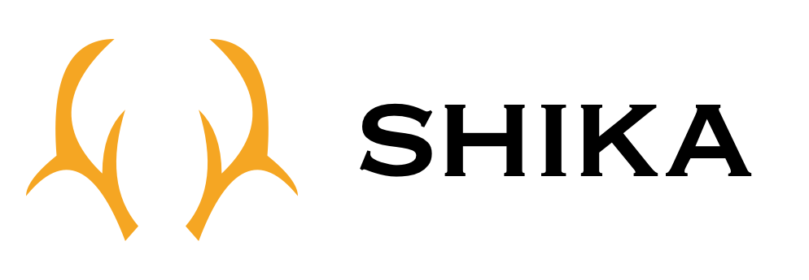
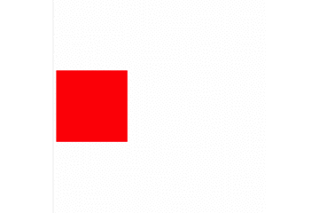
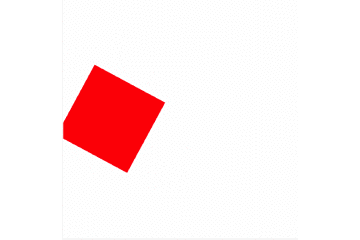
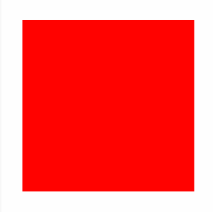
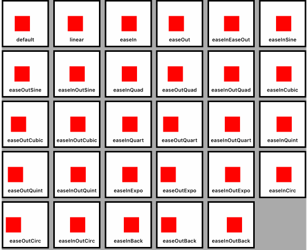

# Simple Interface Core Animation
<p align="center">
    
</p>

<p align="center">
  
  <a href="https://developer.apple.com/swift">
    
  </a>
  <a href="https://github.com/Carthage/Carthage">
    
  </a>
  <br />
  <a href="https://github.com/apple/swift-package-manager">
    
  </a>
  <a href="https://cocoapods.org/pods/Sica">
    
  </a>
  <a href="https://cocoapods.org/pods/Sica">
    
  </a>
</p>

Sica can execute various animations sequentially or parallelly.

## Features
- Animation with duration and delay
- parallel / sequence animation
- Easings
- Springs
- Transition

## Requirements
- Xcode 9.3 or greater
- iOS 9 or greater
- tvOS 10.0 or greater
- macOS 10.11 or greater
- Swift 4.2 (since 0.3.4)


## Installation

### Carthage

If you’re using [Carthage](https://github.com/Carthage/Carthage), simply add
Sica to your `Cartfile`:

```ruby
github "cats-oss/Sica"
```

### CocoaPods

Sica is available through [CocoaPods](https://cocoapods.org). To instal
it, simply add the following line to your Podfile:

```ruby
pod 'Sica'
```

### Swift Package Manager
Sica is available through `SwiftPM`, create ` Package.swift` and add `dependencies` value
```Package.swift
dependencies: [
    .package(url: "https://github.com/cats-oss/Sica.git", from: "0.4.1")
]
```
See also: [GitHub - j-channings/swift-package-manager-ios: Example of how to use SPM v4 to manage iOS dependencies](https://github.com/j-channings/swift-package-manager-ios)

## Usage

### Sample Animation

#### Sequence Animation
If you set `.sequence`, sequence animation is shown.
```swift
let animator = Animator(view: sampleView)
animator
    .addBasicAnimation(keyPath: .positionX, from: 50, to: 150, duration: 2, timingFunction: .easeOutExpo)
    .addSpringAnimation(keyPath: .boundsSize, from: sampleView.frame.size, to: CGSize(width: 240, height: 240), damping: 12, mass: 1, stiffness: 240, initialVelocity: 0, duration: 1)
    .run(type: .sequence)
```



#### Parallel Animation
If you set `.parallel`, parallel animation is shown.
```swift
let animator = Animator(view: sampleView)
animator
    .addBasicAnimation(keyPath: .positionX, from: 50, to: 150, duration: 5, timingFunction: .easeOutExpo)
    .addBasicAnimation(keyPath: .transformRotationZ, from: 0, to: CGFloat.pi, duration: 3, timingFunction: .easeOutExpo)
    .run(type: .parallel)
```



#### Forever Animation
If you set `forever` before calling `run`, forever animation is shown.
```swift
let animator = Animator(view: sampleView)
animator
    .addBasicAnimation(keyPath: .positionX, from: 50, to: 150, duration: 2, timingFunction: .easeOutExpo)
    .addBasicAnimation(keyPath: .positionX, from: 150, to: 50, duration: 2, timingFunction: .easeOutExpo)
    .forever(autoreverses: false)
    .run(type: .sequence)
```


#### Cancel
If you want to cancel animation, you should call `cancel`.
```swift
let animator = Animator(view: sampleView)
/*
Add animation and run
*/
animator.cancel() // Animation cancel
```

#### Remove Added Animations
If you call `run` and then you call add animation method, no animation will be added.
If you use animator again, you call `removeAll` before `addBasicAnimation` or `addSpringAnimation` or `addTransitionAnimation`.
```swift
let animator = Animator(view: sampleView)
/*
Add animation and run
*/

// Bad
animator.addBasicAnimation() // 🙅 you can't add animation

// Good
animator.removeAll()
        .addBasicAnimation() // 🙆 You can add animation.
```


## Functions
### Add Animation
```swift
    public func addBasicAnimation<T>(keyPath: Sica.AnimationKeyPath<T>, from: T, to: T, duration: Double, delay: Double = default, timingFunction: Sica.TimingFunction = default) -> Self where T : AnimationValueType
    public func addSpringAnimation<T>(keyPath: Sica.AnimationKeyPath<T>, from: T, to: T, damping: CGFloat, mass: CGFloat, stiffness: CGFloat, initialVelocity: CGFloat, duration: Double, delay: Double = default, timingFunction: Sica.TimingFunction = default) -> Self where T : AnimationValueType
    public func addTransitionAnimation(startProgress: Float, endProgress: Float, type: Sica.Transition, subtype: Sica.TransitionSub, duration: Double, delay: Double = default, timingFunction: Sica.TimingFunction = default) -> Self
```

### Add Animation Option
```swift
    public func delay(_ delay: Double) -> Self
    public func forever(autoreverses: Bool = default) -> Self
```

### Animation Operation
```swift
    public func run(type: Sica.Animator.AnimationPlayType, isRemovedOnCompletion: Bool = default, completion: (() -> Swift.Void)? = default)
    public func cancel()
    public func removeAll() -> Self
```

## Extensions

You can access sica property in `UIView` and `CALayer`.

```swift
let view = UIView(frame: ...)
view.sica
    .addBasicAnimation(keyPath: .positionX, from: 50, to: 150, duration: 2, timingFunction: .easeOutExpo)
    .run(type: .sequence)
```

```swift
let layer = CALayer()
layer.sica
    .addBasicAnimation(keyPath: .positionX, from: 50, to: 150, duration: 2, timingFunction: .easeOutExpo)
    .run(type: .sequence)
```

## Support

### Animation
- CABasicAnimation
- CATransition
- CASpringAnimation

### AnimationPlayType
you can choose animation play type
- run animation sequentially
- run animation parallelly

### EasingFunctions
you can choose various timing functions



### KeyPaths Table
|Sica|KeyPath|
|:-:|:-:|
|`.anchorPoint`|`anchorPoint`|
|`.backgroundColor`|`backgroundColor`|
|`.borderColor`|`borderColor`|
|`.borderWidth`|`borderWidth`|
|`.bounds`|`bounds`|
|`.contents`|`contents`|
|`.contentsRect`|`contentsRect`|
|`.cornerRadius`|`cornerRadius`|
|`.filters`|`filters`|
|`.frame`|`frame`|
|`.hidden`|`hidden`|
|`.mask`|`mask`|
|`.masksToBounds`|`masksToBounds`|
|`.opacity`|`opacity`|
|`.path`|`path`|
|`.position`|`position`|
|`.shadowColor`|`shadowColor`|
|`.shadowOffset`|`shadowOffset`|
|`.shadowOpacity`|`shadowOpacity`|
|`.shadowPath`|`shadowPath`|
|`.shadowRadius`|`shadowRadius`|
|`.sublayers`|`sublayers`|
|`.sublayerTransform`|`sublayerTransform`|
|`.transform`|`transform`|
|`.zPosition`|`zPosition`|

#### Anchor Point
|Sica|KeyPath|
|:-:|:-:|
|`.anchorPointX`|`anchorPoint.x`|
|`.anchorPointy`|`anchorPoint.y`|

#### Bounds
|Sica|KeyPath|
|:-:|:-:|
|`.boundsOrigin`|`bounds.origin`|
|`.boundsOriginX`|`bounds.origin.x`|
|`.boundsOriginY`|`bounds.origin.y`|
|`.boundsSize`|`bounds.size`|
|`.boundsSizeWidth`|`bounds.size.width`|
|`.boundsSizeHeight`|`bounds.size.height`|

#### Contents
|Sica|KeyPath|
|:-:|:-:|
|`.contentsRectOrigin`|`contentsRect.origin`|
|`.contentsRectOriginX`|`contentsRect.origin.x`|
|`.contentsRectOriginY`|`contentsRect.origin.y`|
|`.contentsRectSize`|`contentsRect.size`|
|`.contentsRectSizeWidth`|`contentsRect.size.width`|
|`.contentsRectSizeHeight`|`contentsRect.size.height`|

#### Frame
|Sica|KeyPath|
|:-:|:-:|
|`.frameOrigin`|`frame.origin`|
|`.frameOriginX`|`frame.origin.x`|
|`.frameOriginY`|`frame.origin.y`|
|`.frameSize`|`frame.size`|
|`.frameSizeWidth`|`frame.size.width`|
|`.frameSizeHeight`|`frame.size.height`|

#### Position
|Sica|KeyPath|
|:-:|:-:|
|`.positionX`|`position.x`|
|`.positionY`|`position.y`|


#### Shadow Offset
|Sica|KeyPath|
|:-:|:-:|
|`.shadowOffsetWidth`|`shadowOffset.width`|
|`.shadowOffsetHeight`|`shadowOffset.height`|

#### Sublayer Transform
|Sica|KeyPath|
|:-:|:-:|
|`.sublayerTransformRotationX`|`sublayerTransform.rotation.x`|
|`.sublayerTransformRotationY`|`sublayerTransform.rotation.y`|
|`.sublayerTransformRotationZ`|`sublayerTransform.rotation.z`|
|`.sublayerTransformScaleX`|`sublayerTransform.scale.x`|
|`.sublayerTransformScaleY`|`sublayerTransform.scale.y`|
|`.sublayerTransformScaleZ`|`sublayerTransform.scale.z`|
|`.sublayerTransformTranslationX`|`sublayerTransform.translation.x`|
|`.sublayerTransformTranslationY`|`sublayerTransform.translation.y`|
|`.sublayerTransformTranslationZ`|`sublayerTransform.translation.z`|

#### Transform
|Sica|KeyPath|
|:-:|:-:|
|`.transformRotationX`|`transform.rotation.x`|
|`.transformRotationY`|`transform.rotation.y`|
|`.transformRotationZ`|`transform.rotation.z`|
|`.transformScaleX`|`transform.scale.x`|
|`.transformScaleY`|`transform.scale.y`|
|`.transformScaleZ`|`transform.scale.z`|
|`.transformTranslationX`|`transform.translation.x`|
|`.transformTranslationY`|`transform.translation.y`|
|`.transformTranslationZ`|`transform.translation.z`|


## License
Sica is available under the MIT license. See the [LICENSE file](https://github.com/cats-oss/Sica/blob/master/LICENSE) for more info.
